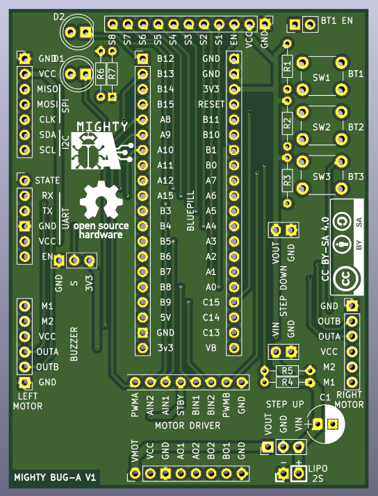

# Mighty Bug-A Board v1

Control board for the line follower racing car project designed at [A Industriosa](https://intranet.aindustriosa.org/).

* Check the 3D printed chassis designs at [https://gitlab.com/punkto/line_follower_3d_designs](https://gitlab.com/punkto/line_follower_3d_designs)

* For the firmware refer to [https://github.com/hmightypirate/AllMyCircuits](https://github.com/hmightypirate/AllMyCircuits)

## Warning!

**This board is made public here just for documentation purposes but its use in new designs is not recommended.** There is a major design flaw that makes the board burn when too much current is drawn. The step down regulator (AMS1117-3.3) can source up to 800 mA as stated in its datasheet. The problem is that the max output current is greatly affected by the difference between the input and output voltages. In this case The power source is a 2S lipo battery that provides 8.4V when fully charged. When converting this voltage down to 3.3V to power all the electronics, a lot of power is dissipated in the regulator making it burn when too much current is demanded.

**This issue is fixed in version v1.1 that can also be found in this repository.**

## Description

Designed to control a line follower racing car based on differential drive, this board includes an STM32F103 microcontroller coupled with a TB6612FNG dual channel motor driver and a U3V12F9 step-up regulator to power two Pololu micro metal gearmotors at stable 9V. The board provides headers to connect the motors using the magnetic encoder boards mounted on them.

To detect the position of the line, a QTR-8A array featuring 8 Fairchild QRE1113 reflectance sensors is connected to the right angle header mounted on the front.

2 LEDs, 3 push buttons and a buzzer are provided to configure the board and give feedback while the car is on the track.

There is also a UART header that can be used to program the microcontroller and to establish a communication link through cable or Bluetooth if an HC-05 adapter is used.

To expand the capabilities of the board, I2C and SPI buses are available on a header so that other hardware (like an IMU or a slave microcontroller) can be added at any time.

## BOM

Item | Description | Quantity
------------ | ------------- | ------------- |
Bluepill | STM32F103 microcontroller board | 1
AMS1117-3.3 | 3.3V Step-down voltage regulator | 1
U3V12F9 | 9V Step-up regulator board from Pololu | 1
Buzzer | Passive buzzer board | 1
TB6612FNG | 2 Channel motor driver board | 1
5 mm LED | 5mm LEDs of different colors | 2
Push button | Through hole push buttons | 3
100Ω Resistor | Through hole resistors | 5
47kΩ Resistor | Through hole resistors | 1
20kΩ Resistor | Through hole resistors | 1
40x1 Female socket 2.54mm pitch | Female socket to plug, the bluepill, the motor driver and the Bluetooth module to the board | 1
40x1 Male pin 2.54mm pitch | Male pin strip to plug the motors, the battery, the expansion boards and the jumper to the board | 1
40x1 Right angle male pin 2.54mm pitch | Male pin strip to connect the reflectance sensor array to the board | 1
33uF Capacitor | Electrolytic capacitor to connect to the output of the step up regulator | 1

## Acknowledgements

This work was inspired by the great job done in the micromouse maze solving robot Bulebule by [Bulebots](https://github.com/Bulebots):

[https://github.com/Bulebots/bulebule](https://github.com/Bulebots/bulebule)
