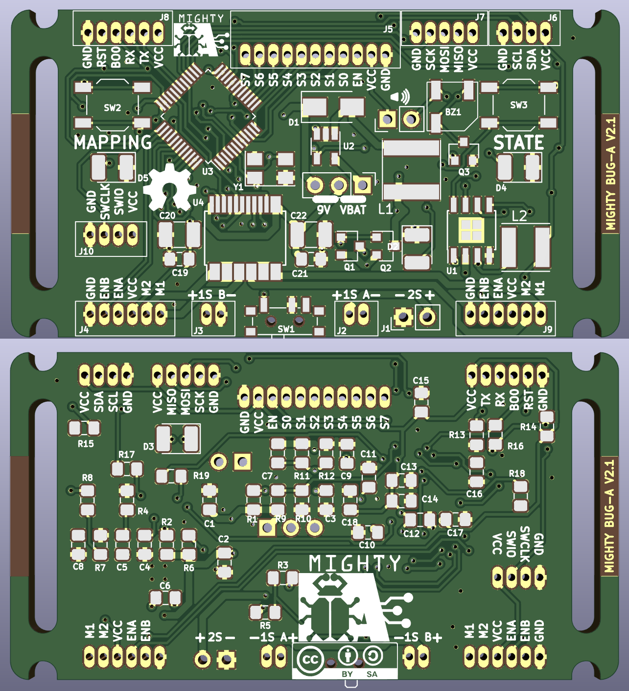

# Mighty Bug-A Board v2.1

Control board for the line follower racing car project designed at [A Industriosa](https://intranet.aindustriosa.org/).

* Check the 3D printed chassis designs at [https://gitlab.com/punkto/line_follower_3d_designs](https://gitlab.com/punkto/line_follower_3d_designs)

* For the firmware refer to [https://github.com/hmightypirate/AllMyCircuits](https://github.com/hmightypirate/AllMyCircuits)

## Description

Designed to control a line follower racing car based on differential drive, this board includes an STM32F103 microcontroller coupled with a TB6612FNG dual channel motor driver and a U3V12F9 step-up regulator to power two Pololu micro metal gearmotors at stable 9V. The board provides headers to connect the motors using the magnetic encoder boards mounted on them.

To detect the position of the line, a QTR-8A array featuring 8 Fairchild QRE1113 reflectance sensors is connected to the right angle header mounted on the front.

2 LEDs, 2 push buttons and a buzzer are provided to configure the board and give feedback while the car is on the track.

There is also a UART header that can be used to program the microcontroller and to establish a communication link through cable or Bluetooth if an HC-05 adapter is used.

To expand the capabilities of the board, I2C and SPI buses are available on a header so that other hardware (like an IMU or a slave microcontroller) can be added at any time.

## BOM

Reference | Description | Quantity
------------ | ------------- | ------------- |
BZ1 | MLT-5020 SMD buzzer | 1
C1, C14 | 0805 ceramic capacitor, 1uF | 2
C10, C11 | 0805 ceramic capacitor, 20pF | 2
C12, C13, C15, C16, C17, C19, C21 | 0805 ceramic capacitor, 100nF | 7
C2 | 0805 ceramic capacitor, 10uF | 1
C20, C22 | 0805 ceramic capacitor, 10uF | 2
C3 | 0805 ceramic capacitor, 56nF | 1
C4 | 0805 ceramic capacitor, 100pF | 1
C5 | 0805 ceramic capacitor, 3.9nF | 1
C6 | 10nF | 1
C7 | 15pF | 1
C8 | 22uF | 1
C9, C18 | 4.7uF | 2
D1 | B220A-13-F | 1
D2 | 1210 Green LED | 1
D3 | 1N4148 1210 diode | 1
D4 | 1210 Red LED | 1
D5 | 1210 Blue LED | 1
J1, JP2 | 2 pin 2.54mm vertical header | 2
J2, J6, J7 | JST B6B-ZR connector | 3
J3 | JST S11B-ZR | 1
J4 | JST B4B-ZR | 1
J5 | B5B-ZR | 1
JP1 | 3 pin 2.54mm straight header | 1
L1 | Taiyo Yuden_NR-60xx 4.7uH inductor | 1
L2 | Taiyo Yuden NR-50xx 10uH inductor | 1
Q1, Q2 | SI2369DS P-Channel 30V MOSFET, SOT-23 | 2
Q3 | S8050 NPN Transistor, SOT-23 | 1
R1, R6, R7, R9, R10, R13, R14, R15, R16, R19 | 0805 Resistor, 10k | 10
R11 | 0805 Resistor, 47k | 1
R12 | 0805 Resistor, 7.5k | 1
R17, R18 | 0805 Resistor, 100 | 2
R2, R3, R5, R20 | 0805 Resistor, 100K | 4
R4 | 0805 Resistor, 6.8k | 1
R8 | 0805 Resistor, 26.1k | 1
SW1 | PCM12 SPDT switch | 1
SW2, SW3 | TL3343 Push button | 2
U1 | MP2307DN | 1
U2 | SC4503 | 1
U3 | STM32F103C8T6 | 1
U4 | TB6612FNG | 1
Y1 | 5032 8Mhz crystal | 1

## Acknowledgements

This work was inspired by the great job done in the micromouse maze solving robot Bulebule by [Bulebots](https://github.com/Bulebots):

[https://github.com/Bulebots/bulebule](https://github.com/Bulebots/bulebule)
